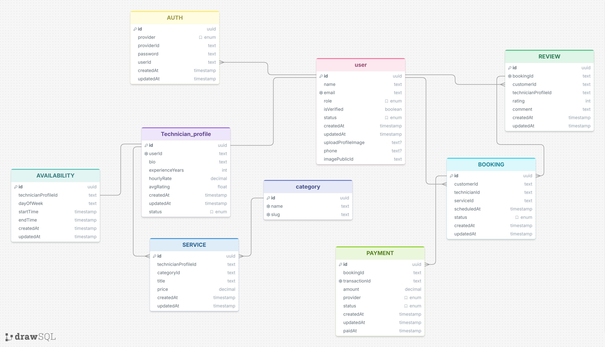

# HandyHub — Database Schema Design (v2)

Updated to match the actual `.prisma` models and diagram decided during the build. Supersedes the original draft — every field, enum, and constraint below is what's currently implemented.

---

## 1. Design Approach

Admin, Customer, and Technician are **one `User` table** with a `role` enum — not three separate tables. Reasons:
- Auth logic (password, verification, account status) is identical across all three roles.
- One `role` field lets a single middleware guard every route (`requireRole("ADMIN")`).
- Only **Technician** needs extra data (bio, rate, live status) — that lives in `TechnicianProfile`, linked 1:1 to `User`, so Customers/Admins don't carry unused columns.

---

## 2. Enums

All enums live in `prisma/schema/enums.prisma`.

```prisma
enum Role {
  ADMIN
  CUSTOMER
  TECHNICIAN
}

enum UserStatus {
  ACTIVE
  DEACTIVATED
  BANNED
  DELETED
}

enum TechnicianStatus {
  AVAILABLE
  BUSY
  OFFLINE
}

enum BookingStatus {
  REQUESTED
  ACCEPTED
  DECLINED
  PAID
  IN_PROGRESS
  COMPLETED
  CANCELLED
}

enum PaymentProvider {
  STRIPE
  PAYPAL
  BKASH
}

enum PaymentStatus {
  PENDING
  PAID
  FAILED
  REFUNDED
  CANCELLED
}
```

**Notes on the enum decisions:**
- `UserStatus` replaces a plain `isBanned` boolean — it covers self-deactivation, admin bans, and soft-delete in one mutually-exclusive field instead of stacking booleans.
- `TechnicianStatus` is a **live indicator only** ("on a job right now" vs "open for work") — it does not prevent double-booking by itself. Slot conflicts are checked separately, in the booking service, against existing `Booking.scheduledAt` rows.
- `BookingStatus` follows the original project flow exactly: `REQUESTED → ACCEPTED/DECLINED → PAID → IN_PROGRESS → COMPLETED`, with `CANCELLED` allowed any time before `IN_PROGRESS`.
- `PaymentProvider` currently lists `STRIPE`, `PAYPAL`, `BKASH` — this **differs from the original spec** (Stripe/SSLCommerz). Confirm this was an intentional switch before integrating an SDK.

---

## 3. Entity List

| # | Entity | Purpose |
|---|--------|---------|
| 1 | `User` | Base account for Admin, Customer, and Technician |
| 2 | `TechnicianProfile` | Extra data for users with `role = TECHNICIAN` |
| 3 | `Availability` | Recurring weekly time slots a technician is open |
| 4 | `Category` | Service categories (plumbing, electrical, etc.) |
| 5 | `Service` | A specific service a technician offers |
| 6 | `Booking` | A job booked by a customer with a technician |
| 7 | `Payment` | Payment transaction(s) tied to a booking |
| 8 | `Review` | Customer's review of a completed booking |

---

## 4. Models

### 4.1 `User`

| Field | Type | Key | Required? | Notes |
|---|---|---|---|---|
| `id` | String (UUID) | **PK** | Mandatory | |
| `name` | String | — | Mandatory | |
| `email` | String | Unique | Mandatory | Login + verification/reset emails |
| `password` | String | — | Mandatory | Bcrypt hash |
| `role` | `Role` | — | Mandatory | Default `CUSTOMER` |
| `isVerified` | Boolean | — | Mandatory | Default `false` |
| `status` | `UserStatus` | — | Mandatory | Default `ACTIVE` |
| `avatarUrl` | String | — | Optional | Cloudinary URL |
| `phone` | String | — | Optional | |
| `createdAt` | DateTime | — | Mandatory | |
| `updatedAt` | DateTime | — | Mandatory | |

**Relations:** 1:1 → `TechnicianProfile` · 1:N → `Booking` (as customer) · 1:N → `Booking` (as technician) · 1:N → `Review`

---

### 4.2 `TechnicianProfile`

| Field | Type | Key | Required? | Notes |
|---|---|---|---|---|
| `id` | String (UUID) | **PK** | Mandatory | |
| `userId` | String | **FK → User.id**, Unique | Mandatory | Unique enforces the 1:1 |
| `bio` | String | — | Optional | |
| `experienceYears` | Int | — | Optional | |
| `hourlyRate` | Decimal(10,2) | — | Optional | |
| `avgRating` | Float | — | Mandatory | Default `0`, recalculated on new review |
| `status` | `TechnicianStatus` | — | Mandatory | Default `AVAILABLE` — live indicator, not a slot calendar |
| `createdAt` | DateTime | — | Mandatory | |
| `updatedAt` | DateTime | — | Mandatory | |

**Relations:** 1:1 ← `User` · 1:N → `Availability` · 1:N → `Service` · 1:N → `Review`

---

### 4.3 `Availability`

| Field | Type | Key | Required? | Notes |
|---|---|---|---|---|
| `id` | String (UUID) | **PK** | Mandatory | |
| `technicianProfileId` | String | **FK → TechnicianProfile.id** | Mandatory | |
| `dayOfWeek` | String | — | Mandatory | e.g. `"MON"` |
| `startTime` | String | — | Mandatory | e.g. `"09:00"` |
| `endTime` | String | — | Mandatory | e.g. `"17:00"` |
| `createdAt` | DateTime | — | Mandatory | |
| `updatedAt` | DateTime | — | Mandatory | |

**Relations:** N:1 ← `TechnicianProfile`

> Optional future addition: an `isActive` boolean, so a technician can pause a recurring slot without deleting it.

---

### 4.4 `Category`

| Field | Type | Key | Required? | Notes |
|---|---|---|---|---|
| `id` | String (UUID) | **PK** | Mandatory | |
| `name` | String | Unique | Mandatory | |
| `slug` | String | Unique | Mandatory | URL-safe |

**Relations:** 1:N → `Service`

---

### 4.5 `Service`

| Field | Type | Key | Required? | Notes |
|---|---|---|---|---|
| `id` | String (UUID) | **PK** | Mandatory | |
| `technicianProfileId` | String | **FK → TechnicianProfile.id** | Mandatory | |
| `categoryId` | String | **FK → Category.id** | Mandatory | |
| `title` | String | — | Mandatory | |
| `price` | Decimal(10,2) | — | Mandatory | |
| `createdAt` | DateTime | — | Mandatory | |
| `updatedAt` | DateTime | — | Mandatory | |

**Relations:** N:1 ← `TechnicianProfile` · N:1 ← `Category` · 1:N → `Booking`

> Optional future additions: `description`, `location` (for search filtering), `isActive` (pause a listing without deleting).

---

### 4.6 `Booking`

| Field | Type | Key | Required? | Notes |
|---|---|---|---|---|
| `id` | String (UUID) | **PK** | Mandatory | |
| `customerId` | String | **FK → User.id** | Mandatory | |
| `technicianId` | String | **FK → User.id** | Mandatory | Named relation, since `User` links to `Booking` twice |
| `serviceId` | String | **FK → Service.id** | Mandatory | |
| `scheduledAt` | DateTime | — | Mandatory | |
| `status` | `BookingStatus` | — | Mandatory | Default `REQUESTED` |
| `createdAt` | DateTime | — | Mandatory | |
| `updatedAt` | DateTime | — | Mandatory | |

**Relations:** N:1 ← `User` (customer) · N:1 ← `User` (technician) · N:1 ← `Service` · 1:N → `Payment` · 1:1 → `Review` (optional)

> `Booking → Payment` is 1:N, not 1:1: a failed charge can be retried, creating a second `Payment` row. Only the latest `PAID`/completed payment is authoritative; status transitions between bookings are enforced in application code (a `VALID_TRANSITIONS` map), not by the database.

---

### 4.7 `Payment`

| Field | Type | Key | Required? | Notes |
|---|---|---|---|---|
| `id` | String (UUID) | **PK** | Mandatory | |
| `bookingId` | String | **FK → Booking.id** | Mandatory | |
| `transactionId` | String | Unique | Mandatory | ID from payment provider |
| `amount` | Decimal(10,2) | — | Mandatory | |
| `provider` | `PaymentProvider` | — | Mandatory | |
| `status` | `PaymentStatus` | — | Mandatory | Default `PENDING` |
| `paidAt` | DateTime | — | Optional | Set only when payment succeeds |
| `createdAt` | DateTime | — | Mandatory | |
| `updatedAt` | DateTime | — | Mandatory | |

**Relations:** N:1 ← `Booking`

---

### 4.8 `Review`

| Field | Type | Key | Required? | Notes |
|---|---|---|---|---|
| `id` | String (UUID) | **PK** | Mandatory | |
| `bookingId` | String | **FK → Booking.id**, Unique | Mandatory | Unique enforces one review per booking |
| `customerId` | String | **FK → User.id** | Mandatory | |
| `technicianProfileId` | String | **FK → TechnicianProfile.id** | Mandatory | Denormalized — avoids a join through `Booking` when recalculating `avgRating` |
| `rating` | Int | — | Mandatory | 1–5, validated at the application layer |
| `comment` | String | — | Optional | |
| `createdAt` | DateTime | — | Mandatory | |
| `updatedAt` | DateTime | — | Mandatory | |

**Relations:** 1:1 ← `Booking` · N:1 ← `User` (customer) · N:1 ← `TechnicianProfile`

---

## 5. Relationship Summary

| Relationship | Cardinality | Enforced by |
|---|---|---|
| User → TechnicianProfile | 1 : 1 | Unique `TechnicianProfile.userId` |
| TechnicianProfile → Availability | 1 : N | `Availability.technicianProfileId` |
| TechnicianProfile → Service | 1 : N | `Service.technicianProfileId` |
| Category → Service | 1 : N | `Service.categoryId` |
| User (customer) → Booking | 1 : N | `Booking.customerId` |
| User (technician) → Booking | 1 : N | `Booking.technicianId` |
| Service → Booking | 1 : N | `Booking.serviceId` |
| Booking → Payment | 1 : N | `Payment.bookingId` |
| Booking → Review | 1 : 1 | Unique `Review.bookingId` |
| User (customer) → Review | 1 : N | `Review.customerId` |
| TechnicianProfile → Review | 1 : N | `Review.technicianProfileId` |

No many-to-many relationships exist in this schema. (A future "favorite technicians" feature would introduce the first true M:N, via a join table like `FavoriteTechnician(userId, technicianProfileId)`.)

---

## 6. ER Diagram

Rendered version: see the Mermaid `erDiagram` widget generated during the build, or view it live at your [drawSQL diagram](https://drawsql.app/teams/kazi-ashikur/diagrams/handyhub).



---

## 7. File Split (`prisma/schema/`)

```
prisma/schema/
├── schema.prisma              # generator + datasource only
├── enums.prisma                # Role, UserStatus, TechnicianStatus, BookingStatus, PaymentProvider, PaymentStatus
├── user.prisma
├── technician_profile.prisma
├── availability.prisma
├── category.prisma
├── service.prisma
├── booking.prisma
├── payment.prisma
└── review.prisma
```

---

## 8. Decisions Made

| Decision | Resolution |
|---|---|
| `Booking.technicianId` → `User.id` or `TechnicianProfile.id`? | Resolved: points at `User.id`, using named relations (`"CustomerBookings"`, `"TechnicianBookings"`) since `User` links to `Booking` twice |
| Soft delete vs hard delete | Resolved: soft delete via `UserStatus.DELETED` — rows are never hard-deleted, since `Booking`/`Payment`/`Review` hold foreign keys to `User.id` |
| `Review.technicianProfileId` denormalization | Kept — avoids an extra join through `Booking` every time `avgRating` is recalculated |
| Live technician status vs slot calendar | Resolved: `TechnicianProfile.status` is a display-only indicator; actual double-booking prevention happens in the booking service via a query against overlapping `Booking.scheduledAt` values |

## 9. Still Open

- Confirm `PaymentProvider` (`STRIPE`/`PAYPAL`/`BKASH`) vs the original spec (`STRIPE`/`SSLCOMMERZ`) — intentional change or drift?
- Decide whether to add `isActive` to `Availability` and `Service` for pausing without deleting.
- Decide whether `Service` needs `description`/`location` for search/filtering (in the public browse API).
